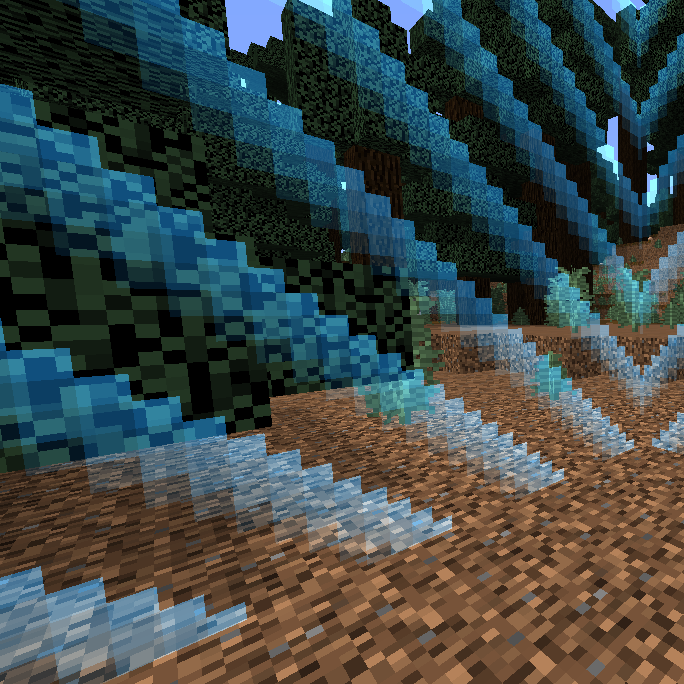
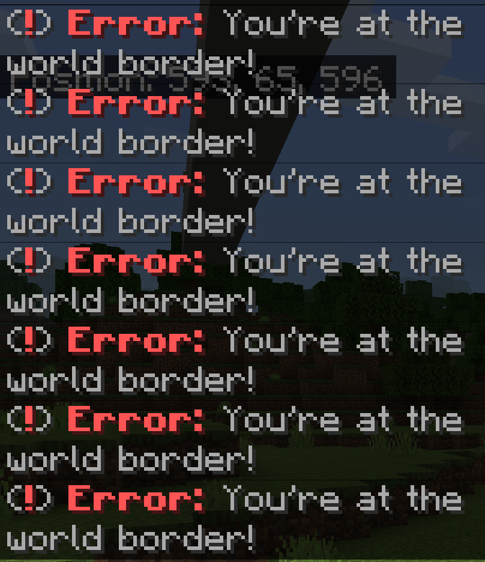

**This plugin is not yet ready for Poggit**
# TODO:
- Remove Border Spam
- Prefix Config
- Commands to Set/Create Borders!
- Teleport to default levels spawn option when border crossing

# WorldBorder Info-
Prevent players from passing a certain point in your server worlds! 
Stops glitchers trying to get past the border locking them in an uncomfortable position! 
The border unfortunately does **not** have a literal view like the icon!  

# Common Questions-
**Q: Could a player teleport past the world border via command or ender pearl?** 
**A**: Nope! Anything player who passes the border will be frozen, and recieve the error message. This meaning the only way they could escape the border is by executing a warp command (ie. /spawn) or /suicide.  
**Q: How can I choose where the border is? **
**A**: Using the configuration, setup your desired world and length. Configuration should be located under "Plugin Data\WorldBorder".  
**Q: Is there a way to change the border message via config? **
**A**: Unfortunately, there is not at the moment. However, I plan to add more features to this plugin overtime. You can open an issue on the Github for any suggestions!  

# Setup-
- Download the plugin zip or phar
- Upload to folder "plugins" on your PocketMine-MP server
- Restart the server
- Set your desired world and world size under the "plugin data" folder and restart / reload your server

# Contact
- Soul ✞#9999 (Discord) 

# Execution

# Reporting Bugs
To report a bug, open an issue on the Github: 
https://github.com/Pinesolz/WorldBorder
